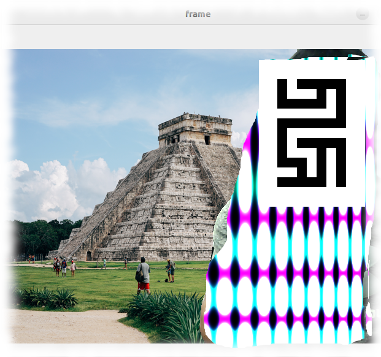

# Virtual_Studio
## You can create Personal virtual studio easily!!

- Using webcam creating easy broadcasting envrionment.
- Only person tracking and hide your background.
- Don't mind show your realtime video even if background is messy;)


## My environment
Pytorch 2.0.1

torchvision 0.15.2

opencv-python 4.7.0.72

Pillow  9.3.0


## wherever you can take movie! Whenever you want
- Without setting up studio
- just you configure background image file only
- Easy create Virtual studio
- Other use case virtual travel? As you like. 

# command line

```
python studiocam.py

```
Enjoy shooting your DIY movie!
- Press 'q' quit

## command line : studiocapture

```
python studiocapture.py

```
- Press 's' key start capture video by MP4 format
- Press 'q' quit


## Replace background image

```

# Load the background image
background = Image.open('background.jpg')
background = background.resize((640, 480))  # Adjust this to match your webcam resolution
background = np.array(background)  # Keep the background in its original color scale

```
### AI pre-trained model : models.segmentation.deeplabv3_resnet101

## Example


# Movie sample

https://youtu.be/LKrsrvXfox4


- due to using doll, some part show background. but real person is no problem!

# Resolution arrangement
**Please check SD_size sub directory codes**
in the code define movie and background image resolution.
Although using Pytorch(GPU), fps is depends on machine and resolution;)

```
# Load the background image
## Attention!! change code for novice engineer utilize SD size code for your convenience. 
background = Image.open('background.jpg')
background = background.resize((1280, 720))  # Adjust this to match your webcam resolution
background = np.array(background)  # Keep the background in its original color scale

cap = cv2.VideoCapture(0)

# Set the video resolution to 1280x720
cap.set(cv2.CAP_PROP_FRAME_WIDTH, 1280)
cap.set(cv2.CAP_PROP_FRAME_HEIGHT, 720)
```

## Original contributor
Manyan3 (mi-kaneyon) 

### Thanks (utilize sample)

https://unsplash.com/photos/VPavA7BBxK0

Photographer Filip Gielda 
